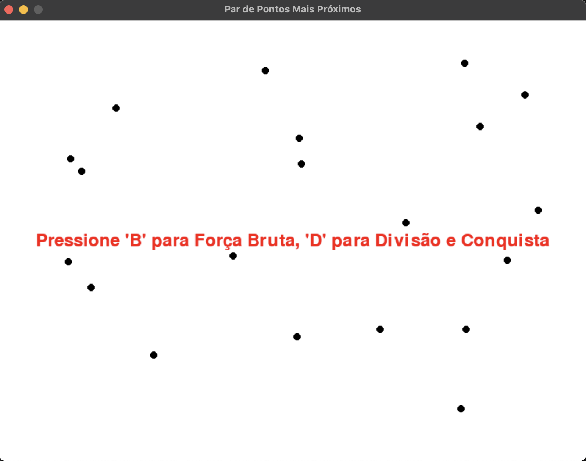

**!! Atenção: Renomeie o seu repositório para D&C_PardePontoseForçaBruta. !!** 

Temas:
 - D&C

# Par de Pontos com Dividir e Conquistar x Força Bruta

**Número da Lista**: X 
**Conteúdo da Disciplina**: XXXXXXXXXX 

## Alunos
|Matrícula | Aluno |
| -- | -- |
| 20/0038028  |  Guilherme Evangelista Ferreira dos Santos |
| xx/xxxxxx  |  xxxx xxxx xxxxx |

## Sobre 
Exemplifica o funcioamento do algoritmo de par de pontos usando a divisão e conquista x força bruta

## Screenshots

Print1

Print2

Print3

## Instalação 
**Linguagem**: Python
**Framework**: Biblioteca pygame
Python 3 instalado juntamente com a biblioteca pygame em seu módulo.

## Uso 
Aperte B para ele descobrir o par de pontos mais proximos usando força bruta .
Aperte D para ele descobrir o par de pontos mais proximos usando divisão e consquista .

## Outros 
Quaisquer outras informações sobre seu projeto podem ser descritas abaixo.
